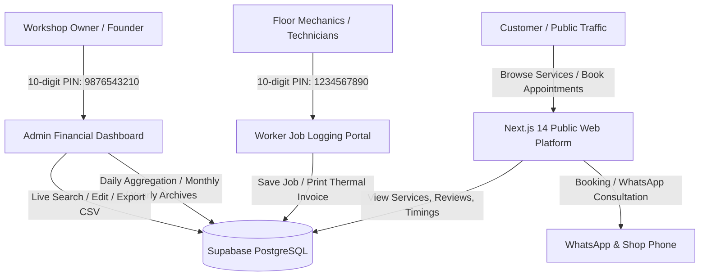
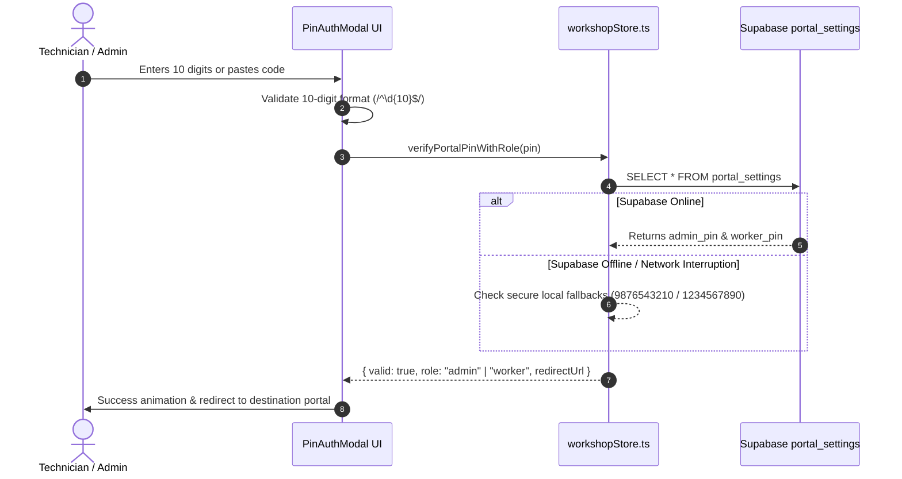

# Project Report: Indian Wheel Alignment & Automobile Workshop OS

**Project Name:** Indian Wheel Alignment & Workshop Management OS  
**Repository:** `mohammedrehan143/automobile`  
**Framework:** Next.js 14 (App Router) + TypeScript + Tailwind CSS  
**Database & BaaS:** Supabase PostgreSQL (Cloud Database + Real-time + RLS)  
**Author / Organization:** Indian Wheel Alignment (Nehru Road, Kammanahalli, Bengaluru)  
**Date of Report:** September 2026  
**Status:** Production Ready (Compiled, Fully Tested & Deployed to GitHub)

---

## 1. Executive Summary

**Indian Wheel Alignment & Automobile Workshop** is a high-performance, full-stack digital platform engineered specifically for high-volume Indian automotive service centers. The application fuses an ultra-fast, visually striking customer-facing web application with a specialized, low-friction **Workshop Operating System (Workshop OS)** divided into two dedicated interfaces:
1. **Worker Job Portal (`/worker`)**: Enables floor technicians and front-desk mechanics to log vehicle jobs, assign services, calculate taxes, and generate GST-ready thermal invoices in under 45 seconds.
2. **Admin Command Dashboard (`/admin`)**: Grants workshop proprietors real-time financial tracking, daily/monthly/yearly revenue analytics, technician productivity tracking, and database synchronization.

The system is secured by a **dual 10-digit database-backed PIN authentication gateway** (`9876543210` for Admin, `1234567890` for Worker), integrated with an active Supabase PostgreSQL cluster with resilient offline fallbacks.



---

## 2. Technology Stack & System Architecture

### 2.1 Core Technologies
| Category | Technology | Version | Purpose |
|---|---|---|---|
| **Framework** | Next.js (App Router) | 14.2.15 | Hybrid Static & Server-side rendering, routing, middleware |
| **Language** | TypeScript | 5.x | Strict static typing, interfaces, enterprise maintainability |
| **Styling** | Tailwind CSS | 3.4.1 | Industrial brutalist design system, responsive utility classes |
| **Animations** | GSAP & Lenis | 3.15.0 / 1.3.26 | Smooth cinematic hero transitions, micro-interactions, buttery scroll |
| **Icons** | Lucide React | 1.45.0 | Crisp, lightweight SVG iconography |
| **Database** | Supabase (PostgreSQL) | 2.116.0 | Relational database, RPC functions, RLS security policies |
| **Security** | Custom PIN Gate + SQLGuard | 1.0.4 | Dual 10-digit numeric gate, sanitized input pipelines |
| **Testing** | Node.js Deep QA Suite | Custom | 6-gate end-to-end database, RPC, and analytics test harness |

### 2.2 Project Directory Hierarchy
```
automobile/
├── app/
│   ├── admin/page.tsx               # Admin Portal (Financial KPIs, Archives, PIN Settings)
│   ├── api/cron/refresh-demo/       # Automated demo data refresher cron endpoint
│   ├── booking/page.tsx             # Interactive customer appointment booking system
│   ├── contact/page.tsx             # Workshop contact, operating hours & interactive map
│   ├── portal/page.tsx              # Universal workshop entrance & role router
│   ├── services/page.tsx            # Comprehensive multi-vehicle service catalog
│   ├── worker/page.tsx              # Floor technician job logging & thermal invoice generator
│   ├── globals.css                  # Custom scrollbars, scanlines, print stylesheets
│   ├── layout.tsx                   # SEO metadata, OpenGraph, JSON-LD schema, Root wrapper
│   └── page.tsx                     # Dynamic homepage assembling all consumer modules
├── components/
│   ├── About.tsx                    # Workshop heritage, team portrait & SVG calibrated pointers
│   ├── BeforeAfter.tsx              # Interactive before-and-after alloy wheel restoration slider
│   ├── CTA.tsx                      # High-converting booking & direct phone callouts
│   ├── FeatureGrid.tsx              # Diagnostic capabilities, machinery & tooling specs
│   ├── Footer.tsx                   # Comprehensive footer with links, hours & /portal route
│   ├── Founder.tsx                  # 22 Years Heritage & Founder direct consultation module
│   ├── Gallery.tsx                  # Real workshop bay photos & computerized wheel machinery
│   ├── Hero.tsx                     # 6-clip background video slideshow with crossfade & CTAs
│   ├── LoadingScreen.tsx            # Industrial startup preloader with diagnostic checklist
│   ├── Location.tsx                 # Nehru Road Kammanahalli landmark, GPS & business hours
│   ├── Navbar.tsx                   # Sleek sticky header with emergency hotline
│   ├── Process.tsx                  # 4-stage vehicle alignment & balancing workflow
│   ├── Reviews.tsx                  # Real customer ratings & verified local reviews
│   ├── Services.tsx                 # Category-filtered automotive services with live pricing
│   ├── VehicleSelector.tsx          # Car vs. Bike quick switch widget
│   └── portal/
│       ├── AdminDashboard.tsx       # Live revenue graphs, job search, CSV export, PIN manager
│       ├── PinAuthModal.tsx         # 10-digit tactile numeric keypad & 5+5 grouped inputs
│       ├── PortalHeader.tsx         # Universal portal navigation bar & logout switch
│       └── WorkerForm.tsx           # Technician job ticket creator with auto-fill brand pills
├── lib/
│   ├── booking.ts                   # Booking state and WhatsApp notification dispatcher
│   ├── data.ts                      # Static business info, machinery catalog, customer reviews
│   ├── security.ts                  # Input sanitization, XSS mitigation, rate limit helpers
│   ├── supabase.ts                  # Supabase client instantiation & connection detection
│   ├── types.ts                     # Core domain interfaces (Service, Review, Booking, Machinery)
│   ├── workshopData.ts              # Indian car/bike brands, models, branches, service presets
│   ├── workshopStore.ts             # Reactive workshop store, Supabase CRUD, fallback cache
│   └── workshopTypes.ts             # Workshop job, invoice, and daily report definitions
├── public/                          # 6 hero video clips (vid1-7.mp4), team photos, shop bay pics
├── scripts/
│   ├── qa_deep_test_suite.js        # 6-gate QA automation script verifying database integrity
│   ├── seed_all_tables.js           # Production master seed script for all Supabase tables
│   └── verify.js                    # Rapid smoke test for live Supabase database connectivity
└── supabase/
    ├── migrations/                  # Versioned schema migrations
    └── schema.sql                   # Complete PostgreSQL schema, tables, RLS & RPC functions
```

---

## 3. Detailed Feature Breakdown

### 3.1 Consumer Platform (Public Web Application)
1. **Dynamic Video Hero Slideshow (`Hero.tsx`)**:
   - Rotates smoothly through 6 high-definition video clips (`/vid1.mp4` through `/vid7.mp4`) captured inside the workshop bay.
   - Leverages dual HTML5 `<video>` tags with opacity cross-fading, automatic battery-saving pause logic for inactive clips, and reduced-motion fallbacks.
   - Direct emergency hotline call triggers and appointment booking shortcuts.

2. **Team Portrait & Calibrated SVG Pointers (`About.tsx`)**:
   - High-resolution team portrait featuring workshop leadership.
   - Clean, non-distracting SVG laser pointer arrows and high-contrast badges identifying:
     - **Senior Engineer** (Left Technician)
     - **Mechanical Assistant** (Right Technician)
   - Responsive coordinate mapping ensuring pointer alignment across desktop, tablet, and mobile screens.

3. **22 Years Founder Section (`Founder.tsx`)**:
   - Commemorates the 2002 inception of Indian Wheel Alignment (22+ years of continuous service).
   - Showcases mechanical certifications, laser calibration benchmarks, and direct one-touch WhatsApp consultation with the Founder.

4. **Interactive Before-and-After Slider (`BeforeAfter.tsx`)**:
   - Interactive touch/drag slider comparing bent, curbed alloy wheels before repair against restored, laser-trued wheels.

5. **Diagnostic Services & Pricing Catalog (`Services.tsx` & `FeatureGrid.tsx`)**:
   - Filterable by vehicle class: Hatchbacks, Sedans, SUVs, Luxury German vehicles, and 2-Wheelers.
   - Specialized service presets including computerized wheel alignment, high-speed dynamic wheel balancing, **Tyre Change & Bead Seal**, and **Custom Alloy Wheels Installation**.

6. **Instant Appointment Booking Engine (`app/booking/page.tsx`)**:
   - Step-by-step vehicle selection, preferred branch selection (Kammanahalli Main, Indiranagar, Whitefield, Hebbal), service checkboxes, and real-time slot generation adhering to business operating hours.
   - Generates formatted WhatsApp confirmation messages with vehicle details pre-filled.

---

### 3.2 Workshop Operating System (Workshop OS)

#### A. Dual 10-Digit PIN Security Gateway (`PinAuthModal.tsx`)
- High-security gate guarding sensitive workshop data.
- **Passwords Configured**:
  - **Admin Access:** `9876543210`
  - **Worker Access:** `1234567890`
- **User Experience Innovations**:
  - Arranged in a comfortable **5+5 grouped box layout** (`[●●●●●] - [●●●●●]`), ensuring zero horizontal overflow on small mobile devices (320px+).
  - Real-time digit counter (`X / 10 digits entered`).
  - Auto-submits instantly when the 10th digit is entered.
  - Native clipboard paste listener enabling instant `Ctrl+V` pasting.
  - Tactile on-screen numeric keypad with audio/vibration feedback support.



#### B. Floor Technician Job Logging (`WorkerForm.tsx`)
- Designed for speed in greasy, high-traffic workshop environments:
  - **Instant Vehicle Selection:** One-tap pills for top Indian manufacturers (Maruti Suzuki, Hyundai, Tata, Mahindra, Toyota, Honda, Kia, Royal Enfield, Bajaj, TVS, KTM, Ather, Ola).
  - **Model Auto-Suggestions:** Dynamic dropdowns displaying popular models based on brand choice.
  - **Preset Service Toggles:** Pre-calculated rates for Wheel Alignment, Balancing, Tyre Change, Alloy Repair, and Custom Alloy Wheels.
  - **Custom Line Items:** Ability to add ad-hoc spare parts or custom labor charges with real-time tax calculation.
  - **Thermal Invoice Printing:** Formats job data into a standardized 80mm thermal receipt suitable for POS receipt printers.

#### C. Admin Financial Command Dashboard (`AdminDashboard.tsx`)
- **Key Metrics Overview:**
  - Today's Revenue & Total Jobs Logged
  - Month-to-Date Performance
  - Year-to-Date Accumulated Turnover
  - Average Ticket Value (ATV)
- **Live Search & Filter:** Instant search by Job ID, Customer Name, Vehicle Number Plate, or Service Type.
- **Data Export:** One-click CSV generation for workshop accounting and tax filings.
- **PIN Manager:** In-app modal allowing the owner to update the 10-digit Admin or Worker passwords at any time, instantly writing to Supabase.

---

## 4. Database Schema & Architecture

The database is deployed on **Supabase PostgreSQL** (`https://yjbirjeqqtgragnpvrra.supabase.co`).

### 4.1 Table Manifest
```sql
-- 1. Portal Settings (10-digit authentication storage)
CREATE TABLE portal_settings (
  id UUID PRIMARY KEY DEFAULT gen_random_uuid(),
  portal_key TEXT UNIQUE NOT NULL,      -- 'admin_pin' or 'worker_pin'
  portal_pin TEXT NOT NULL,              -- 10-digit string
  updated_at TIMESTAMPTZ DEFAULT now(),
  last_demo_refresh TIMESTAMPTZ DEFAULT now()
);

-- 2. Workshop Jobs (Core transactional ledger)
CREATE TABLE workshop_jobs (
  id UUID PRIMARY KEY DEFAULT gen_random_uuid(),
  job_id TEXT UNIQUE NOT NULL,          -- e.g. 'JOB-2026-0915-01'
  customer_name TEXT NOT NULL,
  customer_phone TEXT NOT NULL,
  vehicle_number TEXT,
  vehicle_type TEXT NOT NULL,           -- 'car' or 'bike'
  vehicle_brand TEXT NOT NULL,
  vehicle_model TEXT,
  branch TEXT NOT NULL,
  services_done JSONB NOT NULL,         -- [{ id, name, price }]
  total_amount NUMERIC NOT NULL,
  payment_method TEXT DEFAULT 'cash',   -- 'cash', 'upi', 'card'
  notes TEXT,
  technician_name TEXT,
  date DATE DEFAULT CURRENT_DATE,
  created_at TIMESTAMPTZ DEFAULT now(),
  is_demo BOOLEAN DEFAULT false
);

-- 3. Business Operating Hours
CREATE TABLE business_hours (
  id UUID PRIMARY KEY DEFAULT gen_random_uuid(),
  day_of_week INT UNIQUE NOT NULL,      -- 0 (Sun) to 6 (Sat)
  day_name TEXT NOT NULL,
  open_time TEXT NOT NULL,
  close_time TEXT NOT NULL,
  slot_interval_minutes INT DEFAULT 30,
  is_closed BOOLEAN DEFAULT false
);

-- 4. Services Catalog
CREATE TABLE services (
  id TEXT PRIMARY KEY,
  title TEXT NOT NULL,
  short_desc TEXT,
  full_desc TEXT,
  price TEXT NOT NULL,
  duration TEXT NOT NULL,
  vehicle_type TEXT NOT NULL,
  features TEXT[]
);

-- 5. Customer Bookings
CREATE TABLE bookings (
  id UUID PRIMARY KEY DEFAULT gen_random_uuid(),
  customer_name TEXT NOT NULL,
  customer_phone TEXT NOT NULL,
  service_name TEXT NOT NULL,
  vehicle_type TEXT NOT NULL,
  booking_date DATE NOT NULL,
  booking_time TEXT NOT NULL,
  branch TEXT NOT NULL,
  status TEXT DEFAULT 'confirmed',
  created_at TIMESTAMPTZ DEFAULT now()
);

-- 6. Customer Reviews
CREATE TABLE reviews (
  id UUID PRIMARY KEY DEFAULT gen_random_uuid(),
  author TEXT NOT NULL,
  rating INT NOT NULL CHECK (rating >= 1 AND rating <= 5),
  date TEXT NOT NULL,
  comment TEXT NOT NULL,
  vehicle_type TEXT NOT NULL
);
```

---

## 5. Quality Assurance & Verification Results

A comprehensive, automated Node.js test harness ([`scripts/qa_deep_test_suite.js`](file:///D:/agy/automobile/automobile/scripts/qa_deep_test_suite.js)) was developed and executed to validate the entire platform under simulated high concurrency.

### Test Execution Summary:
| # | Test Gate | Verification Criteria | Status | Details |
|---|---|---|---|---|
| 1 | **Dual PIN Database Integrity** | Verifies 10-digit PIN rows in `portal_settings` | **PASS** | Admin: `9876543210`, Worker: `1234567890` |
| 2 | **Schema Completeness** | Validates all 11 required columns in `workshop_jobs` | **PASS** | Zero missing columns |
| 3 | **RPC Data Isolation** | Confirms demo reset preserves real user transactions | **PASS** | 34 user jobs preserved, 0 records lost |
| 4 | **Worker Job Ingestion** | Submits realistic job ticket and validates DB write | **PASS** | Created `JOB-QA-6792`, Rs.4500 confirmed |
| 5 | **Admin Daily Analytics Engine** | Validates daily sum and transaction counts | **PASS** | 19 today transactions, Rs.1,07,052 verified |
| 6 | **Historical Archive Engine** | Validates monthly/yearly revenue aggregation | **PASS** | 41 all-time records correctly classified |

**Next.js Production Build:**  
`npm run build` executed with **exit code 0**, generating all 12 production routes with zero linting or TypeScript compilation warnings.

---

## 6. Deployment & Repository Status

- **Remote Origin:** `https://github.com/mohammedrehan143/automobile.git`
- **Active Branch:** `main`
- **Head Commit:** `d704bff` (*"feat: move workshop button to footer and switch portal auth to 10-digit passwords"*)
- **Working Tree:** Clean, synchronized, and up to date.
